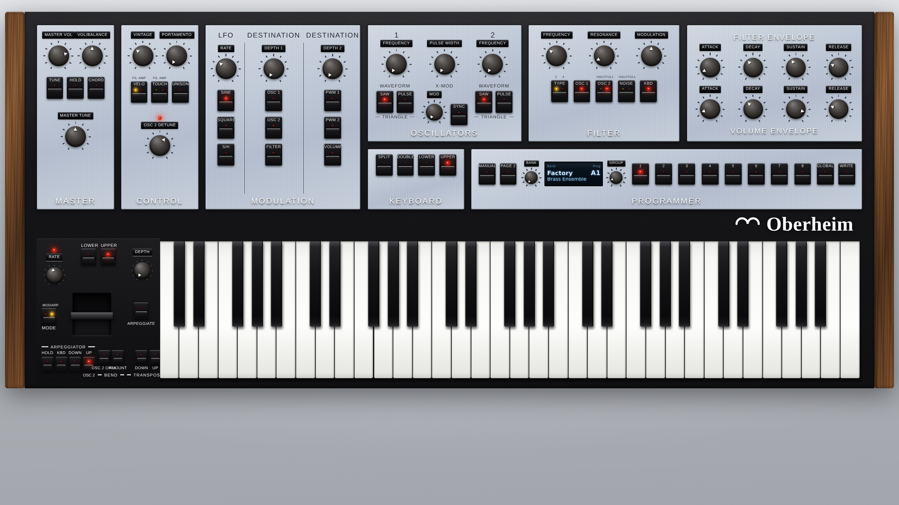

# OB-X

A playable replica of the **Oberheim OB-X** polyphonic synthesizer, built from
the 1979 OB-X Owner's Manual and running entirely in the browser on the Web
Audio API. Eight voices of subtractive synthesis, a 32-program programmer, and
a front panel modelled on the instrument itself.



## Running it

AudioWorklet modules cannot be loaded from `file://`, so the instrument has to
be served over HTTP:

```sh
python3 serve.py --open        # or: python3 -m http.server 8000
```

Then open <http://127.0.0.1:8000/> and press **Power On**.

## Playing it

| Input | How |
| --- | --- |
| Computer keyboard | `A S D F G H J K L ; '` for white keys, `W E T Y U O P` for black; `Z` / `X` shift octave; `Esc` panics |
| On-screen keybed | Click and drag; striking lower on a key gives a higher velocity |
| MIDI | Any connected MIDI input is picked up automatically — notes, pitch bend, mod wheel (CC 1), channel pressure |
| Bend lever | Drag left/right to bend (spring-loaded back to centre), up/down to set modulation depth |

Knobs respond to vertical drag, mouse wheel, and arrow keys when focused.
Hold <kbd>Shift</kbd> for fine adjustment; double-click resets a knob to its
default.

## The architecture

Each of the eight voices follows the manual's signal path:

```
OSC 1 ─ saw / pulse / triangle, 4-octave range ──┐
OSC 2 ─ saw / pulse / triangle, 5-octave range ──┼──▶ FILTER ──▶ VCA ──▶ pan pot
NOISE ─ half / full ─────────────────────────────┘       ▲         ▲
                                     FILTER ENVELOPE ────┘         │
                                              LOUDNESS ENVELOPE ───┘
```

* **Oscillators** are PolyBLEP-band-limited and run at 2× oversampling. Osc 1
  frequency steps in one-octave detents over four octaves; osc 2 steps in
  semitones over five octaves. Selecting both SAW and PULSE gives a triangle,
  as the panel legend indicates. Pulse width runs from a 50 % square fully
  counter-clockwise to a 5 % duty cycle fully clockwise, shared by both
  oscillators. **SYNC** makes osc 1 the master and resets osc 2 on every
  master wrap; **X-MOD** lets osc 2 frequency-modulate osc 1 for
  ring-modulator-like timbres.
* **Filter** is four TPT one-pole stages in a ladder with soft-saturated
  feedback. The manual describes "a two-pole, low-pass type", which is the
  default; the panel's TYPE switch also offers the 24 dB/octave tap. Resonance
  is deliberately capped below self-oscillation, because the manual states the
  filter "cannot be put into oscillation even in its maximum position".
* **Envelopes** are exponential four-stage ADSRs, 1 ms to 10 s, one for the
  filter and one for loudness.
* **LFO** offers sine, square and sample-and-hold (they sum if you select more
  than one, as separate panel switches do), from roughly 0.1 Hz to 20 Hz. DEPTH
  1 routes to osc 1, osc 2 and/or filter frequency; DEPTH 2 routes to the two
  pulse widths and/or volume.
* **Vintage** scatters per-voice tuning, filter cut-off and envelope times, and
  adds a slow shared drift, so voices never sit perfectly on top of each other.
  Pressing **TUNE** re-tunes everything, like the original's AUTO button.
* **Portamento** is polyphonic — each voice glides independently — and works in
  unison, as the manual specifies.

## The programmer

32 programs, addressed as four groups (A–D) of eight, exactly as the original.
**PAGE 2** switches to a second set of 32 for 64 in total.

* Select a program with the GROUP knob and a numbered button.
* **MANUAL** swaps the sound over to the panel's own settings.
* Turning any control edits the live program; the display marks it with `*`.
* To store: press **WRITE** (it lights), then press a program button.
* Everything is persisted to `localStorage`; there is no cassette interface.

**KEYBOARD** splits the eight voices into two four-voice layers. **DOUBLE**
plays both layers from every key; **SPLIT** puts the lower layer below the
split point and the upper layer above it — turn SPLIT on and press a key to
set the split point. **LOWER** / **UPPER** choose which layer the panel edits.

## Layout

| File | Contents |
| --- | --- |
| `index.html` | Page shell |
| `src/params.js` | Parameter model — the single source of truth for the UI, the programmer and the DSP |
| `src/ui.js` | Knob and rocker-switch widgets, panel construction, keybed |
| `src/obx.css` | Panel chrome |
| `src/obx-processor.js` | The AudioWorklet DSP engine |
| `src/presets.js` | 32 factory programs |
| `src/app.js` | Programmer, keyboard routing, arpeggiator, MIDI, engine bridge |
| `docs/MANUAL-MAPPING.md` | Every manual control mapped to its parameter, with the manual's own wording |

## What this is and is not

The synthesis architecture, control ranges and programmer behaviour come from
the OB-X Owner's Manual. The panel layout follows a later OB-X-derived plugin
skin, which adds controls the 1979 instrument did not have — VINTAGE,
VOL/BALANCE, the 4-pole filter option, VELO and TOUCH routing, split/double
keyboard modes and an arpeggiator. `docs/MANUAL-MAPPING.md` marks each of
those as an addition and lists what the manual describes but this build does
not implement (the cassette interface, the internal PROTECT switch, hardware
pan-pot trimming and the foot-control inputs).

This is an independent project inspired by the Oberheim OB-X. It is not
affiliated with, endorsed by, or connected to Oberheim or its parent
companies.
